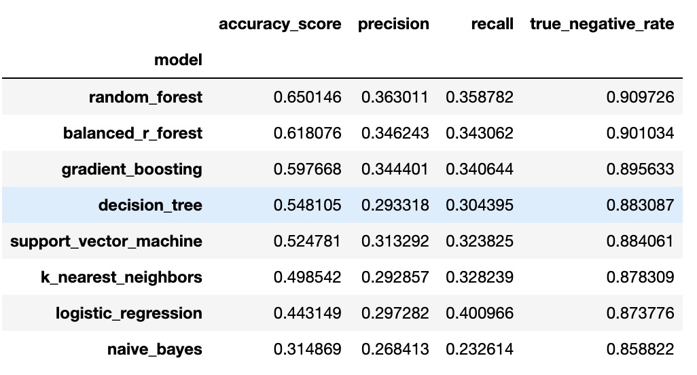
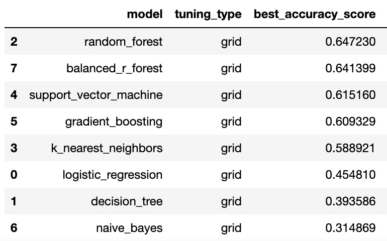
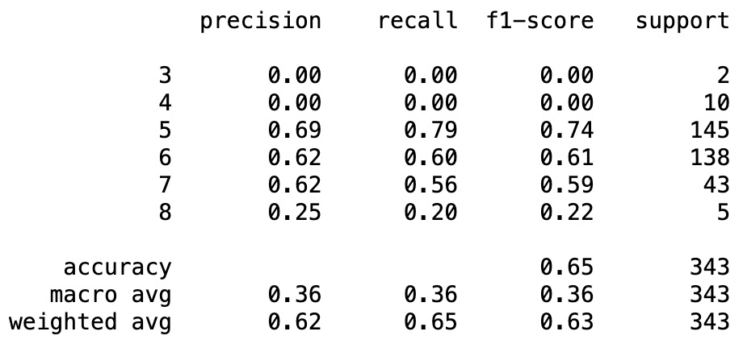
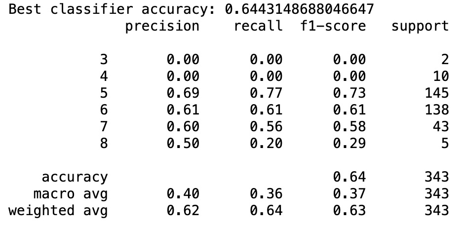
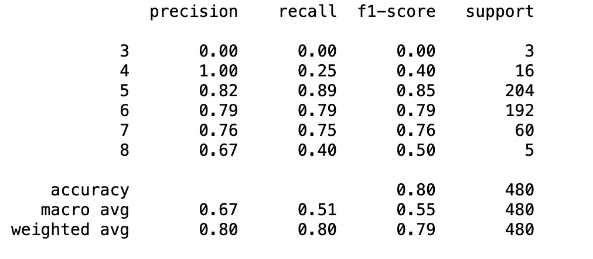

# WINE QUALITY  FROM PHYSICOCHEMICAL PROPERTIES

## INTRODUCTION
This project looks at the potential for hyperparameter optimisation to improve the performance of a wine
quality classifier model. It aims to create a model that can predict wine quality from 0-10 from a selection of physicochecmical properties

The project is split into a few sections:
1. Analysing the data and preparing it for analysis
2. Testing different models and comparing their performand
3. Testing Parameter optimization on the selected model and its competitors for reference

The main focus of this project is to look at a very basic model selection and parameter optimisation example with some input data and see how this affects the performance.
Overall the model performed well on the middle range classes as there were enough samples to correctly train the data but the bias in the samples proved poor performance on the lower and higher end of the scales where the classes were a minority i.e the worst and the best wines. 

## DATA
The data used is a data set from Kaggle about wine with physicochemical test result data about a certain set of Vinho Verde wines and the quality ratings from drinkers sensory feedback.
[Link to source](https://www.kaggle.com/datasets/yasserh/wine-quality-dataset?resource=download) created by Paulo Cortez, A. Cerdeira, F. Almeida, T. Matos and J. Reis in 2009
The raw data was also used (the red wine set) to test the final model. [Original Data](http://www3.dsi.uminho.pt/pcortez/wine/)

## MODEL 
This task is to classify the wines by quality rating from 1-10 from the given inputs.
The model selected from the analysis is a RandomForestClassifier from sklearn.ensemble as it performed best against a range of different classifiers as per the below results:



## HYPERPARAMETER OPTIMIZATION
Hyperparameter optimization was performed using both Bayes and GridSearch for both the selected model and the competitors. The grid search was also performed on competing models as reference to the original model selection.
#### The default hyperparameters used are for the best version of the RandomForestClassifier are: 
```
{ 
    'ccp_alpha': 0.0, 
    'class_weight': None, 
    'criterion': 'gini', 
    'max_depth': None, 
    'max_features': 'sqrt', 
    'max_leaf_nodes': None, 
    'max_samples': None, 
    'min_impurity_decrease': 0.0, 
    'min_samples_leaf': 1, 
    'min_samples_split': 2, 
    'min_weight_fraction_leaf': 0.0, 
    'n_estimators': 100
}
```

The parameters for the 'best' of the tuned model are as below where the only difference seen is the max depth and min samples split:
```
{
    'ccp_alpha': 0.0, 
    'class_weight': None, 
    'criterion': 'gini', 
    'max_depth': 30, 
    'max_features': 'sqrt', 
    'max_leaf_nodes': None, 
    'max_samples': None, 
    'min_impurity_decrease': 0.0, 
    'min_samples_leaf': 1, 
    'min_samples_split': 5, 
    'min_weight_fraction_leaf': 0.0, 
    'n_estimators': 100, 
}
```

#### Although the same hierarchy occurred gains were seen in some of the other models: 


## RESULTS

Performance did not improve overall with hyperparameter tuning in this case but it did appeal to improve in terms of precision across classes i.e 8.
#### Plain Model Performance


#### Optimized Model Performance


The model was then tested against the originating red-wine data set with much better results:



Although the testing performance was lower the result on the larger original dataset it was much higher.  
