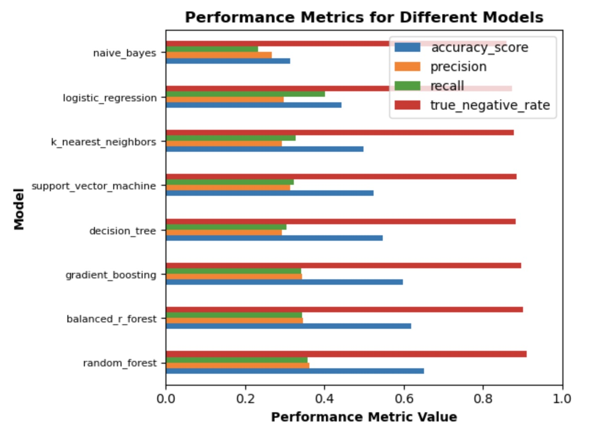
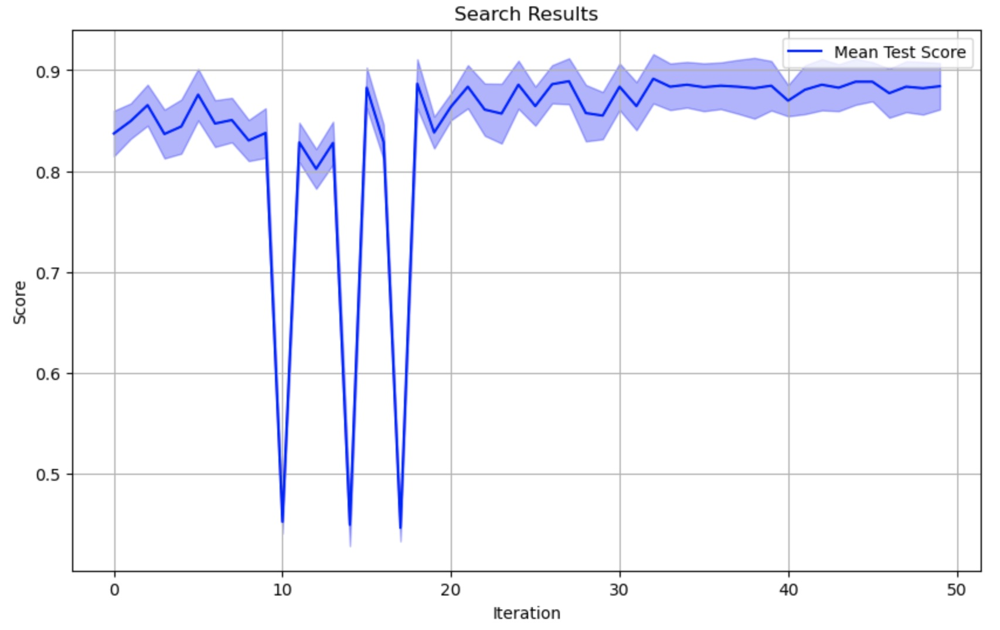
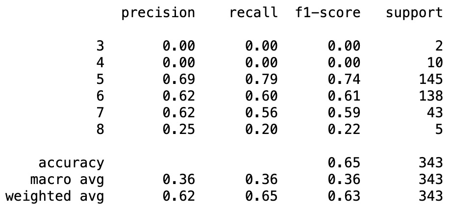
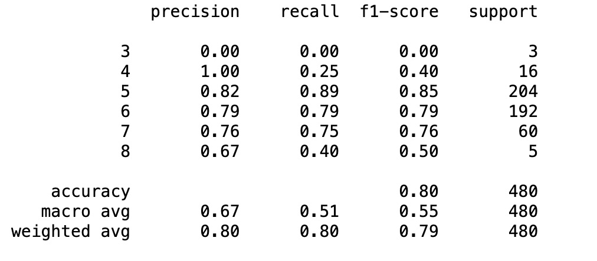

# Model Card

This model looks at the physicochemical properties of wines and tries to predict a quality rating.

## Model Description

**Input:** 
CSV data rows of 11 physicochemical numerical properties of wine: 0 - fixed acidity, 1 - volatile acidity, 2 - citric acid, 3 - residual sugar, 4 - chlorides, 5 - free sulfur dioxide, 6 - total sulfur dioxide, 7 - density, 8 - pH, 9 - sulphates, 10 - alcohol

**Output:** 
1 numerical wine quality rating between 0 and 10

**Model Architecture:** 

The data was split into a training and test set with stratified splitting and oversampled to compensate for the biased samples with a couple class minorities.
A prebuilt RandomForestClassifier from sklearn.ensemble with parameters tuned by GridSearchCV 

## Performance

Comparing the model to other models, the basic model choice had the best accuracy

Plotting the optimization cycles taken by the BayesSearch 

Results of the chosen model on the test set:

Results of the chosen model on the original slightly larger dataset of red-wines:

## Limitations

* The data set did not include the full range of values from 0 to 10 (skipping 0-2 and 9 and 10). 
* The data set did not include a very balanced sample 
* Bayesian optimization search took a long time to run so I opted for GridSearch for parameter optimization

## Trade-offs

The model doesn't predict well with the lower and higher end of the ranges well currently as the data set was very unbalanced. 
